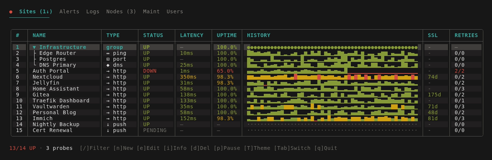
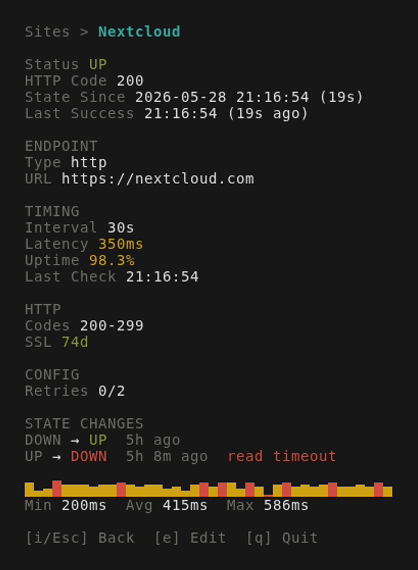
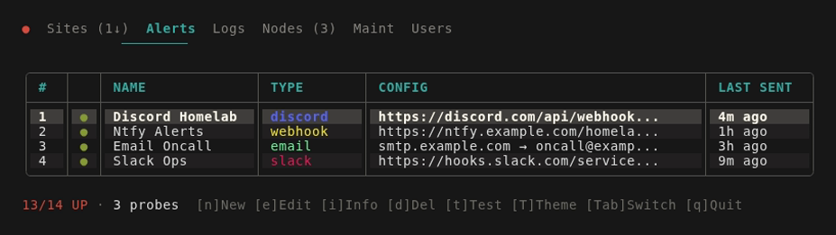
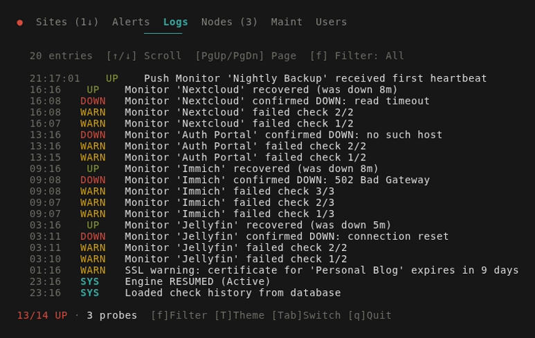
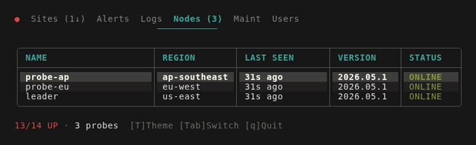
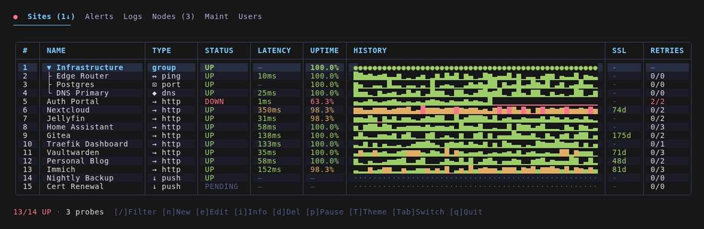

<div align="center">
  <h1>uptop</h1>
  <p>Self-hosted uptime monitoring with a TUI over SSH.</p>
  <p>No browser. No client install. Just <code>ssh -p 23234 your-server</code>.</p>

  <p>
    
    
    
  </p>

  
</div>

## What is this

An uptime monitor you manage entirely from the terminal. It runs as a server, exposes an SSH endpoint, and drops you into a full TUI — monitors, alerts, logs, nodes, all there.

Built on [RDGames/go-upkeep](https://github.com/RDGames/go-upkeep). Rewritten for clustering, config-as-code, and a proper dashboard.

## Features

- **6 check types** — HTTP, Push (heartbeat), Ping, Port, DNS, Groups
- **9 alert providers** — Discord, Slack, Email, Ntfy, Webhook, Telegram, PagerDuty, Pushover, Gotify
- **Config as code** — define monitors in YAML, apply declaratively, version control your setup
- **HA clustering** — leader/follower with automatic failover
- **Prometheus metrics** — `/metrics` endpoint, wire it straight to Grafana
- **Public status page** — HTML + JSON, toggle with an env var
- **SQLite or Postgres** — SQLite for single-node, Postgres for production
- **Uptime Kuma import** — migrate from Kuma with one command

## Screenshots

<table>
  <tr>
    <td></td>
    <td></td>
  </tr>
  <tr>
    <td></td>
    <td></td>
  </tr>
  <tr>
    <td colspan="2" align="center"></td>
  </tr>
</table>

## Quick start

```bash
go run cmd/uptop/main.go
ssh -p 23234 localhost
```

Want some data to look at first:

```bash
go run cmd/uptop/main.go -demo
```

## Install

<details>
<summary><strong>Docker (recommended)</strong></summary>

```yaml
services:
  uptop:
    image: lerkolabs/uptop:latest
    restart: unless-stopped
    ports:
      - "23234:23234"
      - "8080:8080"
    environment:
      - UPTOP_DB_TYPE=sqlite
      - UPTOP_DB_DSN=/data/uptop.db
      - UPTOP_STATUS_ENABLED=true
      # - UPTOP_ADMIN_KEY=ssh-ed25519 AAAA... you@host
    volumes:
      - ./data:/data
```

First run: set `UPTOP_ADMIN_KEY` to your SSH public key, or attach to the container and add it in the Users tab.

</details>

<details>
<summary><strong>Binary</strong></summary>

Download from [Releases](https://gitea.lerkolabs.com/lerkolabs/uptop/releases).

</details>

<details>
<summary><strong>From source</strong></summary>

```bash
go install gitea.lerkolabs.com/lerkolabs/uptop/cmd/uptop@latest
```

</details>

## Config as code

Export your current monitors:

```bash
uptop export -o monitors.yaml
```

Apply a config file:

```bash
uptop apply -f monitors.yaml
uptop apply -f monitors.yaml --dry-run   # see what would change
uptop apply -f monitors.yaml --prune     # delete anything not in the YAML
```

Full reference in [docs/config-as-code.md](docs/config-as-code.md).

## Environment variables

| Variable | Default | Description |
|---|---|---|
| `UPTOP_PORT` | `23234` | SSH server port |
| `UPTOP_HTTP_PORT` | `8080` | HTTP server port (status page, push, metrics) |
| `UPTOP_DB_TYPE` | `sqlite` | `sqlite` or `postgres` |
| `UPTOP_DB_DSN` | `uptop.db` | Database path or connection string |
| `UPTOP_STATUS_ENABLED` | `false` | Enable public status page |
| `UPTOP_STATUS_TITLE` | `System Status` | Status page title |
| `UPTOP_CLUSTER_MODE` | `leader` | `leader` or `follower` |
| `UPTOP_PEER_URL` | | Leader URL for follower nodes |
| `UPTOP_CLUSTER_SECRET` | | Shared key for cluster + API auth |
| `UPTOP_INSECURE_SKIP_VERIFY` | `false` | Skip TLS verification for checks |
| `UPTOP_ADMIN_KEY` | | SSH public key seeded as first admin on startup |

## Migrating from Uptime Kuma

Export your Kuma backup JSON, then:

```bash
curl -X POST http://localhost:8080/api/import/kuma \
  -H "X-Upkeep-Secret: your-secret" \
  -H "Content-Type: application/json" \
  -d @kuma-backup.json
```

## License

MIT — see [LICENSE](LICENSE).
